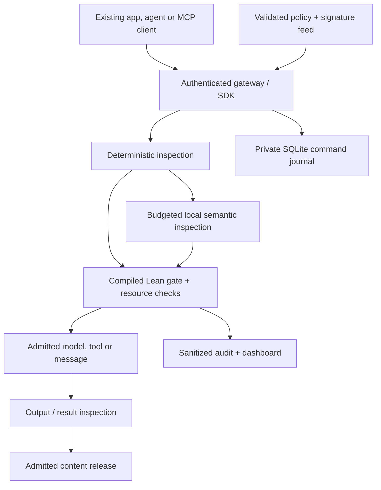

# Mathguard — judge's introduction and repository map

**Mathguard is a control layer for existing AI applications and agents.** It intercepts mediated interactions, applies an editable policy, and allows, redacts, withholds for review or blocks traffic before content is released or a protected action is authorized. Deterministic checks and a local semantic classifier feed a compiled Lean decision kernel. The ledger is a synthetic demonstration of an irreversible tool; no real money moves.

This guide follows the five assessment categories in the organizers' supplied message: **30% / 20% / 20% / 15% / 15%**. The recommended folders below are navigation categories, not new directories. The existing repository layout is retained. Source snapshot: `b69a584`, after PR #7; the test receipts identify their own measured source and binary hashes.

## Start here: run and inspect

Prerequisites: Linux/macOS or WSL2, Python 3.10+, GNU Make, [Lean/elan](https://lean-lang.org/install/) and [Ollama](https://ollama.com/download). Node.js is needed for dashboard tests. Initial dependency and model downloads require internet; inference uses downloaded local weights, without paid APIs.

```sh
# Terminal 1: keep this local-only model service running.
OLLAMA_NO_CLOUD=1 ollama serve
```

```sh
# Terminal 2: from this repository.
ollama pull qwen2.5:1.5b-instruct
make setup MODEL=qwen2.5:1.5b-instruct
make run
```

Open **http://127.0.0.1:8787**. In another terminal run `make credentials`, paste the separate operator/agent/owner tokens into their dashboard fields, then connect a session. Close the credential terminal before screen sharing. For subsequent starts use `make run`; for diagnostics use `make doctor`; for the automated release check use `make test`.

The tested model is **Qwen2.5 1.5B Instruct**, served by Ollama 0.35.1, with a recorded weight digest and Apache 2.0 license. [Exact model record](submission/model-record.json) · [Full judge quickstart](docs/17-JUDGE-QUICKSTART.md) · [Presentation PDF](submission/Mathguard-HackYeah-2026.pdf) · [Slide-by-slide speaker tutorial](docs/18-PRESENTATION-TUTORIAL.md).

| Recommended category | Existing entry points |
| --- | --- |
| `/1-solution` | [Product description](docs/01-PRODUCT-AND-CHALLENGE.md), [policy documentation](policies/README.md), [threat model](docs/11-THREAT-MODEL.md) |
| `/2-architecture` | [Gateway architecture and API contract](docs/13-GENERAL-CONTROL-LAYER.md), [assurance mapping](docs/verification/RELEASE-ASSURANCE.md) |
| `/3-reporting` | [Dashboard source](dashboard/), [dashboard guide](docs/16-DASHBOARD-GUIDE.md), management/audit evidence in [live rehearsal](evidence/live-local-rehearsal.json) |
| `/4-testing` | [Automated tests](tests/), [release receipt](evidence/integration.json), [development evaluation](evidence/live-development-evaluation.json) |
| `/5-implementation` | [Gateway and SDK code](gateway/), [compiled Lean code](Mathguard/), [launcher](scripts/judge.py), [deployment instructions](docs/17-JUDGE-QUICKSTART.md) |

## 1. Solution and guardrails — 30%

**What problem does it solve?** AI clients can disclose sensitive information, follow hostile instructions, invoke unauthorized tools or exhaust resources. A shared enforcement point gives developers policy-controlled access and gives operators decision reasons, resource headroom and an audit trail.

**How is the defense hybrid?** Supported pattern/signature and access checks produce deterministic facts. A local AI classifier supplies a bounded `risk`/`verdict` judgment. The compiled kernel combines independent deny/review/redact flags; a semantic `allow` cannot remove a hard denial. The semantic model is itself allowlisted and budgeted. Chat inspects input, generates an answer, then inspects output before release. [Implementation contract](docs/13-GENERAL-CONTROL-LAYER.md).

| Implemented control | Where to inspect |
| --- | --- |
| Separate operator, agent and owner credentials; server-owned sessions and role/route checks | [HTTP boundary](gateway/server.py), [request engine](gateway/engine.py), [boundary tests](tests/test_boundary_hardening.py) |
| PII/secret redaction or blocking: supported emails, Polish phone/PESEL/IBAN patterns, credentials and key material | [Detectors and strict parser](gateway/control.py), [detector tests](tests/test_detection_hardening.py) |
| Bounded Unicode, encoded and split-content inspection; versioned attack signatures | [Signature feed](feeds/), [policy detector details](policies/README.md), [detector tests](tests/test_detection_hardening.py) |
| Local semantic review/block and strict/balanced/permissive failure handling | [Classifier contract](gateway/semantic.py), [compiled gate](Mathguard/Control.lean), [gateway tests](tests/test_gateway.py) |
| Model/tool allowlists, confidentiality flow checks and exact owner approval for irreversible tools | [Compiled control](Mathguard/Control.lean), [flow model](Mathguard/Flow.lean), [approval handling](gateway/engine.py) |
| Reserve-before-dispatch resource bounds, session/repetition limits, deadlines and timeout quarantine | [Budget kernel](Mathguard/Budget.lean), [provider](gateway/provider.py), [policy budget example](policies/README.md#budget-example) |
| Pinned inert artifact admission; refusal of pickle, remote code, bad hashes and unsupported structures | [Artifact checks](gateway/control.py), [fixed fixture](contracts/artifact-fixture.json), [artifact tests](tests/test_detection_hardening.py) |
| Validated live policy/feed edits; last-good retention; execution closed without a valid configuration | [Policy profiles](policies/), [reload handling](gateway/engine.py), [runtime tests](tests/test_runtime_hardening.py) |
| Single-node durable ledger/resource journal, exact ledger retries, isolated session history and sanitized reporting | [SQLite adapter](gateway/state.py), [engine](gateway/engine.py), [restart/crash tests](tests/test_runtime_hardening.py) |

**What can judges configure?** [Balanced sample](policies/demo.json), [strict sample](policies/strict.json) and [permissive sample](policies/permissive.json) document thresholds, strictness, models/tools, approvals, resource limits, deadlines, output caps, session limits and artifact pins. Setup creates a private live copy with the installed model ID; `local-model` in tracked samples is a test placeholder.

Edit the printed private `policy.json`, increase `epoch`, and select **Reload files**. A valid candidate activates without resetting ledger or quota state. An invalid candidate leaves the last valid policy active and reports an error; with no valid policy/feed pair, dispatch stays closed. Feed changes require a higher `version`. [Complete schema and bounds](policies/README.md).

Artifact admission checks a bounded 12,000-byte inert manifest payload; it does not load a model. Only the documented Safetensors/GGUF subset is admitted. Actual provider weight downloads and arbitrary loader safety are outside that endpoint. [Exact supported formats](policies/README.md#inert-artifact-admission).

## 2. Architecture and performance — 20%



A hard denial stops before inference. Output/result inspection uses the same deterministic and semantic controls before release; the classifier's own verdict is not recursively classified. Python handles authentication, parsing, detector facts and IO. A long-lived compiled worker owns the restriction rules, budgets and ledger state. [Detailed route/release-point map](docs/13-GENERAL-CONTROL-LAYER.md).

**What performance is measured?** The following are observed cases on the recorded development environment, not throughput claims or service-level guarantees:

| Measurement | Recorded result | Evidence / scope |
| --- | ---: | --- |
| Deterministic signature denial | 1.484 ms | [Live rehearsal](evidence/live-local-rehearsal.json); one HTTP case, zero inference calls |
| Tightened PII denial | 1.366 ms | Same rehearsal; one HTTP case, zero inference calls |
| Semantic-only indirect threat denial | 1,076.375 ms | [Development evaluation](evidence/live-development-evaluation.json), `indirect-unmatched`; one classifier call |
| Allowed three-stage local chat | 4,275.593 ms end to end | [Live rehearsal](evidence/live-local-rehearsal.json); input classifier, proposer and output classifier; about 4.26 s across provider stages |
| Native optimized budget reservation at 10,000 tickets | 0.651 ms median batch mean | [Archived native CSV](docs/verification/performance/native.csv); pure-kernel microbenchmark, excludes HTTP, storage and inference |

The dashboard reports request and control **p50/p95 with sample counts**. Control timing means detector facts plus the compiled gate round trip and excludes inference. Individual observations above are not p95 measurements. Hardware/model/context affect latency; the native benchmark is an earlier component measurement. [Method and workload](docs/verification/PERFORMANCE-REVIEW.md).

The sample has a **128-token output cap and a 15-second deadline per call**. Allowed chat uses three separately charged calls. Its conservative total bound is `[0,49152,48000,3]` for cost units, token envelope, compute milliseconds and call slots. The fresh sample budget permits **12 complete chats** before other usage. Shorter measured inference does not refund the conservative charge. [Budget calculation](policies/README.md#budget-example).

## 3. Reporting and management visibility — 20%

**Where is the dashboard?** At the loopback URL printed by `make run`; source is [dashboard/index.html](dashboard/index.html), [app.js](dashboard/app.js) and [style.css](dashboard/style.css). [Operator guide](docs/16-DASHBOARD-GUIDE.md).

**Dashboard screenshot status:** this release contains no checked static dashboard screenshot. View the actual dashboard after connection; the presentation's operator-view slide is an explanation, not a screenshot. For a submission capture, show the overview after an allow, redaction and block, with credential fields concealed. Browser visual/download acceptance remains separate from the passing DOM/request tests. This guide does not substitute a mock image for a captured runtime view.

| Implemented metric / report | Meaning |
| --- | --- |
| Allowed/committed/replayed, blocked/closed, review and redacted counts | Request outcomes; replay counts are not new effects, and redaction can overlap allow |
| Decision reasons and recent audit records | Explain the guardrail that withheld or changed traffic |
| Policy/feed versions, strictness and reload errors | Show current validated policy and rejected edits |
| Exact model identity, live/fixture mode, live calls and validated verdicts | Distinguish real local inference from labeled test fixtures |
| Request/control latency p50/p95 and sample counts | Separate overall delay from enforcement work excluding inference |
| Resource headroom, spent/reserved bounds and observed usage | Cost units, tokens, compute allowance and calls; provider-reported tokens and elapsed adapter time are separate observations |
| Provider quarantine and storage/worker posture | Show uncertain dispatch, persistence mode and current health |
| Management JSON and sanitized JSONL audit export | Decision/version/resource metadata for management; no raw prompts or role tokens |

Inspect `/v1/status`, `/v1/report`, `/v1/events` and `/v1/audit/export` with operator authorization. The UI displays the latest 30 records; exports are bounded to 2,000 per page. Complete retained SQLite history requires pagination starting with `after=0&limit=2000`, then the last returned `audit_id`. Volatile `event_id` is a different anchor. [Report implementation](gateway/engine.py) · [Sanitized export evidence](evidence/live-local-rehearsal.json).

Local model cost is configured as zero monetary charge; resource envelopes and observed elapsed time are not an electricity bill, GPU utilization or a commercial invoice. Management reason rankings use the retained event window. The report retains conservative readiness/remaining-evidence fields; use the dated [release assurance](docs/verification/RELEASE-ASSURANCE.md) for the current evidence inventory.

## 4. Self-testing and showcase cases — 15%

Run **`make test`**. The recorded release passed **189 runtime/integration cases and 14 static regressions**, together with the pinned Lean build, native regressions and a fresh 156-record axiom audit. The runtime suite invokes the actual compiled worker, with explicitly labeled semantic/HTTP fixtures; it requires no paid API or model download. [Machine-readable receipt](evidence/integration.json) · [Suite breakdown and proof boundary](docs/verification/RELEASE-ASSURANCE.md).

| Showcase / test | Expected behavior and source |
| --- | --- |
| Ordinary short question | Allowed if the live classifier admits it; [eight-case development run](evidence/live-development-evaluation.json) |
| `Contact alice@example.com` | Supported email redacted under the sample policy and an admitting semantic verdict; [gateway tests](tests/test_gateway.py) |
| `ignore previous instructions` | Signature block before inference; [live rehearsal](evidence/live-local-rehearsal.json) |
| Tool target `shell.exec` | Allowlist denial before callback; [SDK/boundary tests](tests/test_boundary_hardening.py) |
| Encoded, Polish, Unicode and split payload variants | Supported patterns remain restricted; [detector tests](tests/test_detection_hardening.py) |
| Pickle, remote-code request or unpinned artifact | Admission refused; [artifact tests](tests/test_detection_hardening.py) |
| Budget exhausted, repeated interaction or step cap | Further dispatch denied; [gateway tests](tests/test_gateway.py) |
| Malformed verdict, timeout or oversized/redirected provider response | Profile-specific restriction, charge retention and applicable quarantine; [provider tests](tests/test_provider.py) |
| Valid/invalid live policy edit | Activate valid candidate or retain last good; [runtime tests](tests/test_runtime_hardening.py) |
| Ledger approval and exact retry | Approval alone moves no funds; admitted commit happens once; exact retry causes no second debit; [restart/crash tests](tests/test_runtime_hardening.py) |
| Dashboard metadata and downloads | Text-safe rendering, credential redaction, correct headroom and explicit reconnect after restart; [DOM/request tests](tests/test_dashboard.py) |

Separate live evidence: **ten operational checks** with actual local weights passed in [live-local-rehearsal.json](evidence/live-local-rehearsal.json); **eight development cases** passed in [live-development-evaluation.json](evidence/live-development-evaluation.json). The public corpus was used during classifier development and is not held out. A known indirect input-classifier miss remains: the full gateway follow-up released the proposer's harmless refusal; a separately constructed harmful output was blocked. That is not proof the original input was detected. [Exact follow-up](evidence/prelint-indirect-live.json).

For a five-minute live sequence: allow → redact → hard block → invalid policy retention → ledger approval/retry → management export. Follow [the rehearsal](docs/14-OPERATOR-REHEARSAL.md) and [speaker tutorial](docs/18-PRESENTATION-TUTORIAL.md). Broader unseen detector quality and human browser acceptance remain open.

## 5. Implementation, integration and scalability — 15%

| Important part | Location / responsibility |
| --- | --- |
| HTTP boundary and orchestration | [server.py](gateway/server.py), [engine.py](gateway/engine.py): authentication, sessions, routes, admission, approvals and reporting |
| Detectors, policy/artifact parsing and local inference | [control.py](gateway/control.py), [semantic.py](gateway/semantic.py), [provider.py](gateway/provider.py) |
| Compiled decision/state worker | [Worker.lean](Mathguard/Worker.lean), [Control.lean](Mathguard/Control.lean), [Budget.lean](Mathguard/Budget.lean), [Ledger.lean](Mathguard/Ledger.lean), [Flow.lean](Mathguard/Flow.lean) |
| Single-node journal | [state.py](gateway/state.py): durable intent/completion, exact worker replay and refusal of uncertain recovery |
| Existing application/agent/MCP adapters | [sdk.py](gateway/sdk.py): `chat`, `call_tool`, `send_message`, `inspect` and `allow` |
| Setup, verification and example client | [Makefile](Makefile), [judge.py](scripts/judge.py), [check-local.sh](scripts/check-local.sh), [optional demo client](agent/run.py) |
| Formal assurance and future verification | [Theorem/runtime mapping](docs/verification/RELEASE-ASSURANCE.md), [Aristotle handoff](aristotle/FINAL-HARDENING-HANDOFF.md), [axiom report](docs/verification/axioms.txt) |

**How does it fit existing ecosystems?** An application routes model calls through `ControlClient.chat`; an agent routes peer delivery through `send_message`; an MCP client supplies its existing tool-call function as the trusted callback to `call_tool`. The SDK inspects arguments before invoking that callback and inspects results before returning them. Tool callbacks must validate their sanitized argument schema. The gateway's `/v1/models/chat` owns the three-stage model workflow; `/v1/interactions` supplies shared content admission; `/v1/actions` retains the stronger ledger protocol. [Example integration and API envelopes](docs/13-GENERAL-CONTROL-LAYER.md).

The supported deployment is a **single local node**, with a private compiled worker and an owner-private SQLite journal. Committed balances, receipts, charges and audit survive same-directory restart; sessions and outstanding approvals are invalidated. Every relevant integration boundary must use the layer. Arbitrary unwrapped calls remain outside its perimeter. This is not a complete MCP transport/OAuth implementation or a drop-in OpenAI proxy.

**What limits scalability?** Request handling is serialized, quotas are local, and the reference ledger/budget structures have measured linear scans. Distributed budgets, horizontal failover, hostile-host audit anchoring and exactly-once arbitrary external callback effects are not delivered. A scaling extension would need coordinated quota ownership, durable idempotency and refinement of any indexed replacement. These are future work, not inferred guarantees from fast native timings. [Performance review](docs/verification/PERFORMANCE-REVIEW.md) · [Threat/deployment assumptions](docs/11-THREAT-MODEL.md) · [Dependency licenses and tool disclosure](THIRD-PARTY-NOTICES.md).

## What does “proofs and runtime tests have different scopes” mean?

A Lean theorem proves a stated property for **all inputs satisfying its mathematical assumptions**. A runtime test runs the actual gateway/worker for **particular inputs and failure scenarios**. The compiled gate already uses proved decision definitions. However, not every proved model is the exact runtime transition: the separately proved composite model differs from the financial worker branch, and model audit/memory theorems are not proofs of the Python/SQLite implementation. Authentication, raw JSON, detector truthfulness and IO behavior have their own runtime or empirical evidence. [Exact mapping](docs/verification/RELEASE-ASSURANCE.md#exact-theorem-to-runtime-mapping).

For example, “a semantic allow cannot override a hard denial” is proved for typed gate facts and tested through the real worker. It does **not** prove that the classifier or PII detector always produces the correct facts, or that every external caller uses the gateway. The 156 audit entries are a catalog of theorem/support records, not 156 complete system-security guarantees.

**How do we align the coverage?** Keep one invariant/assumption map linking each security claim to its exact runtime function, theorem and integration tests. Then prove correspondence to the actual code and add matching boundary tests. The existing Aristotle handoff prioritizes: **H1** exact financial worker composition; **H2** durable command/restart contract; **H3** exact generic approvals; **H4** raw-wire/schema correspondence; **H5** policy/feed history; **H6** provider uncertainty/accounting; **H7** runtime audit correspondence. [Concrete targets and counterexamples](aristotle/FINAL-HARDENING-HANDOFF.md).

These tasks can make proofs and tests address the same selected properties. They remain different kinds of evidence. OS/filesystem/compiler/clock and deployment assumptions must stay explicit; detector effectiveness still needs independently unseen empirical evaluation. Current defensible claim: **proved decision rules and modeled state properties; tested runtime integration; measured local-model samples with documented limits**.
