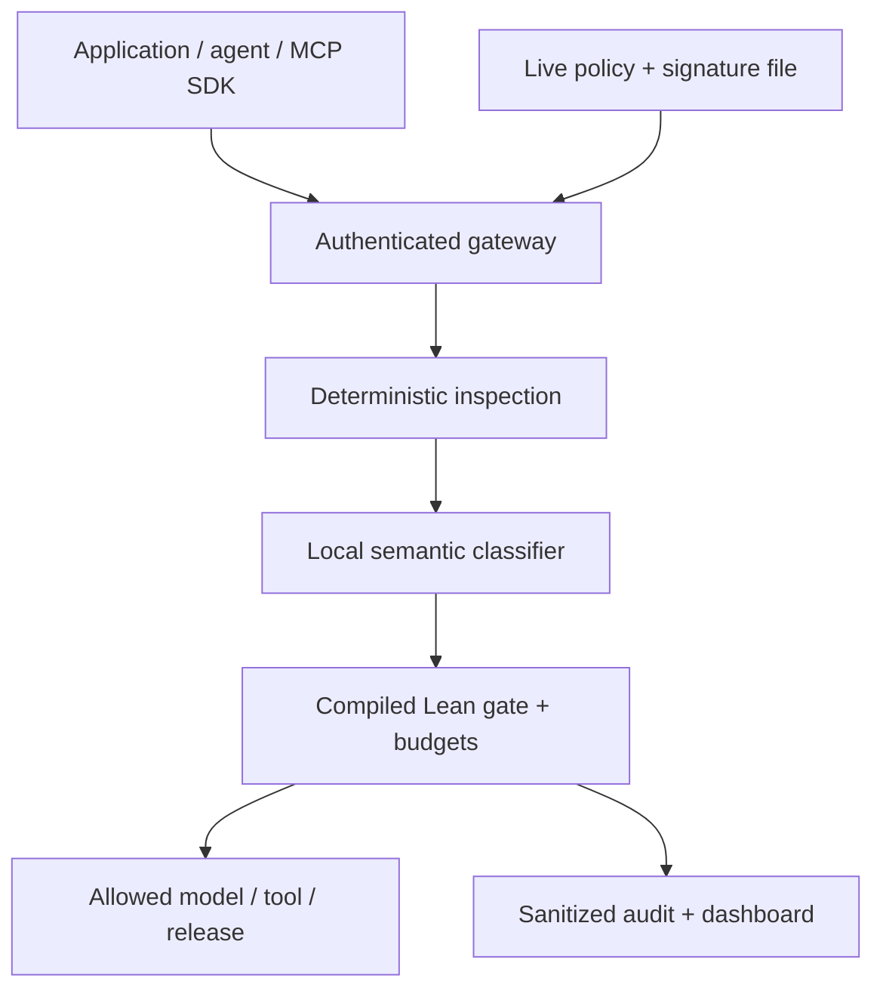

# Mathguard


**A control layer for AI. Inspect every mediated interaction; allow, redact or block before release.**

Mathguard sits between applications/agents and local models, tools or other agents. A file-driven policy combines deterministic controls with a local AI threat classifier. A compiled Lean kernel enforces the restrictions and resource bounds. The sample account ledger demonstrates an irreversible action; the product is the gateway and SDK.

## Run the demo

Use Linux or macOS (Windows: WSL2), Python 3.10+, [Lean/elan](https://lean-lang.org/install/) and [Ollama](https://ollama.com/download). Keep Ollama running with cloud features disabled: `OLLAMA_NO_CLOUD=1 ollama serve`. The first setup downloads pinned Mathlib dependencies and builds the Lean worker; later starts reuse them.

```sh
ollama pull qwen2.5:1.5b-instruct
make setup MODEL=qwen2.5:1.5b-instruct
make run
```

Open **http://127.0.0.1:8787**. In a second terminal, run `make credentials` and paste the separate operator, agent and owner tokens into the dashboard. Credentials stay private on this computer; do not include them in recordings or source control.

Setup discovers the exact installed model ID, checks downloaded local weights and a harmless readiness request through the shared classifier prompt and strict JSON schema, then prepares a private policy and persistent state. It never substitutes a fixture or a paid service. Qwen2.5 1.5B is an approximately 986 MB instruction model distributed under Apache 2.0. [Model source and license](https://ollama.com/library/qwen2.5:1.5b-instruct).

The sample limits responses to 128 tokens with a 15-second call deadline. Replies are deliberately brief. Increase the output allowance only after measuring your hardware; a timeout retains the reservation and quarantines further dispatch.

The smaller 0.5B model falsely blocked all three benign development cases and withheld the redaction case. It is unsuitable for this demonstration; its [failed baseline](evidence/live-development-evaluation-05-baseline.json) is retained. The [model record](submission/model-record.json) identifies the selected weights, engine, digest and license. A readiness check does not establish detector accuracy.

The [ten-case live local rehearsal](evidence/live-local-rehearsal.json) checked three model stages, hard blocks, actual ledger approval/retry, live policy edits, sanitized reporting and restoration of the same journal after restart. Its finite cases do not establish general attack-detection accuracy.

The selected 1.5B model passed all eight [development cases](evidence/live-development-evaluation.json): three benign requests, one email-redaction case and four attacks. This corpus was used during prompt development; it is not held out. [Exploratory diagnostics](evidence/semantic-prompt-development.json) retain an expected-block miss involving instructions in a support note to publish private contact records. Strict output formatting does not prove correct threat detection.

**For a quick demonstration:** connect a session, ask a harmless question, try `Contact alice@example.com` to see redaction, and try `ignore previous instructions` to see a hard block. Edit the printed private `policy.json` path, increment `epoch`, and use Reload. Invalid changes keep the last valid policy; no valid policy closes execution. The ledger panel shows separate owner approval and exact retry without a second payment.

If startup fails, run `make doctor`. The [judge quickstart](docs/17-JUDGE-QUICKSTART.md) explains installation, live policy edits, recovery and the short demonstration. Every model call requires a local model; the automated test suite uses explicitly labeled protocol/classifier fixtures.

## Verify

```sh
make test
```

This is the canonical release check: source audit, pinned Lean build and axiom report, native regressions, gateway/provider/SDK tests and launcher safety tests. It runs the actual compiled Lean worker and requires no model download or paid API. Fixture success checks enforcement behavior; live classifier accuracy needs a separate labeled evaluation. `make smoke` is a quick, isolated launcher check; `make fast` is a source-only preflight.

## Architecture



Every mediated route shares the gate: prompts/model calls, tool calls/results, agent messages and pinned inert artifacts. A semantic allow cannot relax a deterministic denial. The SDK integrates existing clients through trusted callbacks; unwrapped calls are outside its boundary. JSON parsing, authentication, provider behavior and persistence are runtime-tested controls, not additional formal proofs.

The launcher uses an owner-private SQLite journal for single-node state. Restarts preserve charges and ledger state. Uncertain effects or provider cancellation require explicit recovery; the generic callback boundary does not promise exactly-once external effects. Local resource accounting reserves configured conservative bounds, rather than claiming commercial bills or measured GPU consumption.

## Four assessed deliverables

| Deliverable | Where to inspect |
| --- | --- |
| Working control layer + architecture | [`gateway/`](gateway/), [`gateway/sdk.py`](gateway/sdk.py), [runtime contract](docs/13-GENERAL-CONTROL-LAYER.md) |
| Configurable policy | [`policies/demo.json`](policies/demo.json), strict/permissive profiles, private live copy printed by setup |
| Interactive reporting | Dashboard at `/`, management report and sanitized JSONL audit export |
| Automated allowed/blocked/modified and exploit tests | `make test`, [`tests/`](tests/), [`evidence/`](evidence/) |

## Presentation and assurance

- [Presentation PDF](submission/Mathguard-HackYeah-2026.pdf) · [editable slides](submission/Mathguard-HackYeah-2026.pptx) · [speaker tutorial](docs/18-PRESENTATION-TUTORIAL.md).
- [Final release plan](docs/15-FINAL-RELEASE-PLAN.md) · [current status and open acceptance](STATUS.md) · [operator rehearsal](docs/14-OPERATOR-REHEARSAL.md).
- [Formal model and boundaries](docs/05-FORMAL-MODEL.md) · [checked integration](docs/verification/GENERAL-CONTROL-INTEGRATION.md) · [final Aristotle hardening handoff](aristotle/FINAL-HARDENING-HANDOFF.md) · [original proof requests](aristotle/README.md).
- [Source-checked challenge requirements](docs/10-REQUIREMENTS-RECOVERY.md) · [reference notes](reference/SOURCE-NOTES.md) · [requirements adaptation](docs/12-ARISTOTLE-REQUIREMENTS-ADAPTATION.md).

The checked development pins Lean 4.28.0 and Mathlib `8f9d9cff` (`v4.28.0`). The axiom audit has 156 records: 55 baseline, five refinements, 43 Next and 53 Control records. This is a theorem catalogue, not 156 independently proved security requirements. Detection effectiveness, deployment authentication and crash behavior have separate runtime/evaluation evidence.

The official documents disagree on the final two criterion weights (30/20/20/20/10 versus 30/20/20/15/15). Security, architecture/performance and reporting remain the shared priorities. No GitHub Actions workflow or paid API dependency is required. Changes are reviewed through pull requests.
