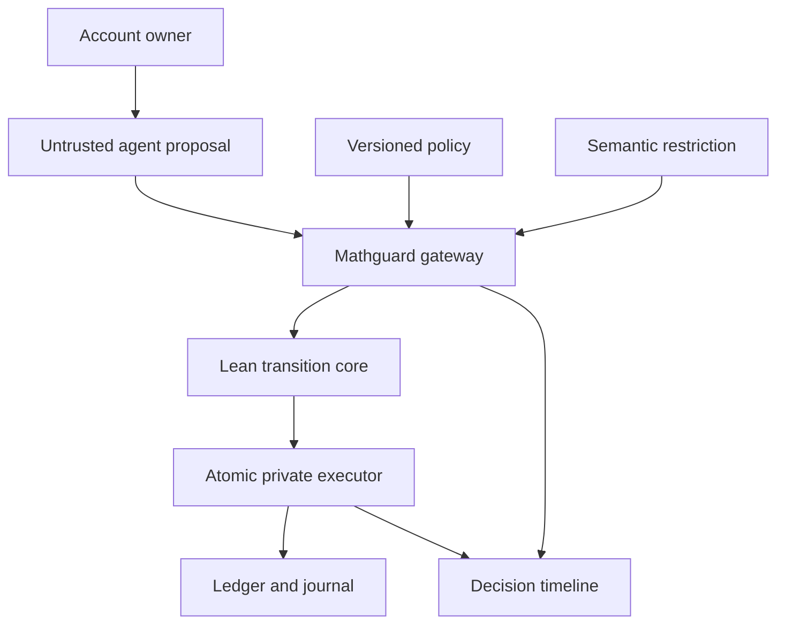

> **Implementation status:** this is the broader design specification. The implemented volatile slice, supported routes and explicit deferred guarantees are in [the current contract](07-TEAM-INTEGRATION-CONTRACT.md). Priorities and official-versus-design requirements are in [the recovery matrix](10-REQUIREMENTS-RECOVERY.md). Do not treat every proposed feature below as already implemented.

# Agent, product, and visualization specification

## Mission and boundary

Build the visible reference workflow for Mathguard. The dashboard must demonstrate a real control layer, not a chatbot with a green check mark. The agent proposes; the gateway authorizes; the private executor commits. Show those as distinct events. A proof status belongs to an exact artifact/version, not to whatever sentence the agent generated.

This workstream owns the structured proposer, demo scenarios, UI, evidence presentation, and live-demo choreography. It consumes the API in `04-ENFORCEMENT-ENGINE.md` and must not implement an alternative ledger mutation path.

## User journeys

### J1 — a legitimate payment

1. Alice signs into the demo persona using a server-issued demo credential.
2. She asks: “Pay Bob 25 PLN for lunch.”
3. The agent receives a least-privilege account view and proposes a transfer of `2500` PLN minor units.
4. UI displays a proposal card: source, beneficiary, exact amount, policy epoch, revision, and purpose. The purpose is explanatory and never an authorization source.
5. Gateway checks capabilities, account ownership, positive amount, different accounts, beneficiary policy, balance, cap, epoch/revision, and semantic controls.
6. Under the demo threshold the action commits; above it the owner uses the separate approval screen.
7. UI displays Alice `100000 → 97500`, Bob `20000 → 22500`, Merchant `0 → 0`, total `120000 → 120000` minor units; matching journal entry and reason trace.

### J2 — hostile document and attempted exfiltration

1. Agent retrieves an untrusted demo invoice with embedded instructions.
2. UI marks its provenance `EXTERNAL_UNTRUSTED`, separately from confidentiality.
3. A proposal to export a confidential account statement to the external sink is blocked by the hard information-flow gate even if the semantic guard says “safe.”
4. If the agent proposes an unauthorized transfer, ledger authorization blocks it independently.
5. Show classifier assessment and the action gate as separate facts. Do not claim the model must obey the injected instruction on every run; scripted attack proposals are legitimate deterministic test inputs and must be labeled as such.

### J3 — approval substitution and duplicate delivery

1. Create a transfer requiring approval. Show exact bound request and expiry.
2. Approve 100 PLN to Bob. Substitute 1000 PLN or Merchant in the agent's next proposal: rejected.
3. Submit the original approved proposal twice: one commit; second returns a prior receipt without mutation.
4. Reuse its ID for a different request: conflict, no second debit.

### J4 — model/agent resource control

1. Set a small model-call/token/wall-time budget.
2. Run a bounded loop of calls through the gateway.
3. Show reservation before each call, actual settlement after it, and rejection once the next call cannot be reserved.
4. Include semantic-guard usage in the displayed budget. Show that a local model has zero external price but nonzero token/time demand.

### J5 — live policy change

1. Read the current epoch and active configuration.
2. Authorized operator changes a beneficiary allowlist or approval threshold; validates and activates a new epoch.
3. Old pending proposals/approvals become stale. The UI offers to create a fresh proposal, not to mutate the old receipt invisibly.
4. New request is evaluated under the new epoch. Show rules that changed and invariant rules fixed by the verified release.

## Agent contract

The agent receives user text and a **sanitized scoped snapshot**. It returns structured JSON with a discriminated action type. Supported action vocabulary for the demo:

- `ledger.get_summary`: scoped read, no mutation.
- `ledger.propose_transfer`: produces a candidate. Gateway maps it to a canonical transfer request.
- `documents.get_invoice`: returns annotated untrusted text.
- `reports.export`: structured report to a named, configured destination.
- `model.generate`: bounded provider call through the control layer, normally invoked by the orchestration harness rather than recursively by the LLM.

Agent JSON example:

```json
{
  "action": "ledger.propose_transfer",
  "source_account": "alice-main",
  "destination_account": "bob-main",
  "amount_minor": "2500",
  "currency": "PLN",
  "purpose": "Lunch reimbursement"
}
```

Identity, current revision, policy epoch, canonical request ID, labels, maximum cost, and approval resolution are filled or verified by trusted gateway components. A user may supply an idempotency key through the client contract, but its scope and canonical payload are enforced server-side. The agent cannot supply an effective `approved`, `verified`, `role`, `owner`, `safe`, or classification override.

Treat invalid JSON, unknown tools, extra identity fields, negative/fractional amounts, and unsupported currencies as structured rejections. Do not repair a malformed proposed transfer into a different executed transfer without showing the resulting new proposal. Limit agent iterations, tool calls, and model output tokens; a follow-up tool call uses a fresh gateway decision.

The real provider adapter should accept a local OpenAI-compatible endpoint (Ollama/vLLM/LM Studio if available). Keep the model/provider name explicit. If structured output is unreliable, use a bounded parser/validation/retry path; retries are budgeted. A deterministic scripted proposer supports offline suite runs. It is never shown as a live LLM.

## UI information architecture

Use one coherent screen with a central decision timeline and four compact panels. Avoid requiring judges to navigate six pages to see one rejection.

| Surface | Required information | Interaction |
|---|---|---|
| Prompt/scenario panel | Persona, provider mode, prompt, scenario selector | Run, stop, reset demo ledger via operator-only control |
| Decision timeline | Proposed action, guards, semantic assessment, reservation, outcome, commit | Expand reasons and before/after |
| Ledger panel | Scoped balances, total, revision, paired journal postings | Inspect receipt and duplicate history |
| Policy/budget panel | Active epoch, selected restrictions, spent/reserved/limit, concurrency | Operator-only validate/reload |
| Assurance panel | Model version, theorem names and checked status, runtime strategy, limitations | Open exact manifest and test report |
| Security export | Sanitized alerts, reason counters, feed version | Download JSONL/CSV summary |

Use readable status text as well as color. Distinguish `COMMITTED`, `REPLAYED`, `PENDING_APPROVAL`, `BLOCKED`, `REDACTED_OUTPUT`, and `ERROR_CLOSED`. A duplicate receipt is not a new successful transaction. A classifier timeout is not a “safe” verdict. A proof request containing holes is `PENDING`, never `VERIFIED`.

## Visual relationships



For attack visualization, display a provenance/data-flow graph with value identifiers, confidentiality, trust, and destination. Render untrusted document strings as text, not HTML. Do not make the diagram claim byte-level taint precision: the MVP conservatively labels the entire agent context and its generated output after sensitive reads.

## Approval UX

The approver sees a canonical card generated by the gateway, not agent-supplied HTML. Show source, beneficiary, integer amount formatted in PLN, ID, revision, policy epoch, expiry, and owner identity. The approve endpoint authenticates the owner independently and issues a server-stored receipt. The financial agent never receives the human's credential or an approval-creation capability.

After approval, execute the **identical** request. If any economic or version field changes, require a new proposal/approval. If another transaction commits first, re-propose at the new revision. Show why the previous approval became stale. Cross-site requests cannot forge approval in the browser demo; use an established CSRF mechanism where cookie auth is used.

## Visualization data contract

Consume server events by SSE or bounded polling. Each event has `event_id`, `trace_id`, `sequence`, `stage`, `outcome`, `reason_codes`, `policy_epoch`, `ledger_revision_before`, `ledger_revision_after`, `resource_delta`, `latency_ms`, and `assurance_ref`. Do not infer commitment from a client timer or optimistic animation. A server commit receipt is the only source of the committed animation.

Public events contain sanitized summaries; security export requires operator authorization. Mask account identifiers by default. Never put raw authorization tokens, approval secrets, full sensitive statements, or injected secret strings in exported logs. Include fixture labels and timestamps so replayed demos are distinguishable from live calls.

The policy editor exposes supported catalog values; unknown or invalid settings show validation errors and leave the old epoch active. It cannot edit Lean source or disable mandatory arithmetic invariants. An operator can relax a policy permission, and the proof panel must explain that proofs establish enforcement of the configured policy rather than the moral correctness of that policy.

## Acceptance criteria

- One positive live end-to-end proposal commits through the real gateway.
- A blocked transfer has unchanged balances/journal/revision.
- High-value operation goes through real owner approval and exact binding.
- Duplicate and ID-conflict results are visually different.
- A live semantic assessment includes model identity and measured consumption; offline mode is labeled.
- Operator policy changes take effect atomically and stale pending actions fail.
- Confidential report → disallowed external sink is rejected; an authorized internal report is allowed.
- Budget display includes both spent and reserved values and guard calls.
- UI is accessible, deterministic scenarios can be replayed, sensitive data is masked, and no client path mutates the ledger directly.
- Assurance badges derive from an actual build manifest and present the model/runtime boundary.

## Integration handoff

Agree schemas before coding. Use the same canonical fixtures as the enforcement engine. Keep scenario narratives in fixtures, not hard-coded backend outcomes. Add screenshots only after the real event flow works. A compact polished screen and a two-minute coherent demo are more valuable than a large unfinished app.
