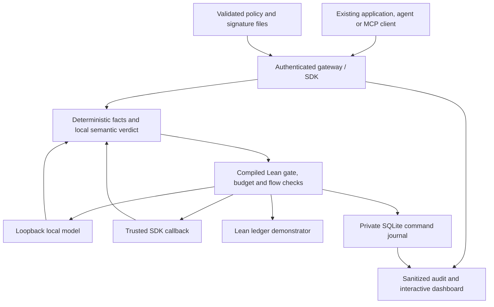

# Enforcement engine — current runnable specification

Mathguard is a **control layer**, implemented as an authenticated loopback HTTP gateway and a small interception SDK. It regulates existing AI clients; the reference agent and account ledger are demonstration clients. Deterministic detector facts and a local semantic classifier enter the actual compiled Lean gate. The Python host does not reimplement the gate's restriction algebra or the financial state machine.

Start with [17-JUDGE-QUICKSTART.md](17-JUDGE-QUICKSTART.md). The public financial envelope is documented in [07-TEAM-INTEGRATION-CONTRACT.md](07-TEAM-INTEGRATION-CONTRACT.md); generic interception is documented in [13-GENERAL-CONTROL-LAYER.md](13-GENERAL-CONTROL-LAYER.md). The [extended proposal](design/ENFORCEMENT-EXTENDED-PROPOSAL.md) is historical design/backlog, not a second supported API.

## Architecture and trust boundary



Every integrated boundary must pass through the layer. A client that invokes a model or tool directly is outside this perimeter. SDK callbacks are trusted application code; the SDK is neither a sandbox nor a complete MCP transport/OAuth implementation. The local serving daemon and owner of the runtime directory are trusted deployment infrastructure.

## Current policy schema

The accepted schema is **`mathguard-policy-3`**, validated by `gateway/control.py`. Schemas 1 and 2 are rejected. Unknown/missing keys, duplicate keys, invalid types/ranges and unsafe resource-envelope settings fail validation. Configuration values use bounded integers; financial wire quantities separately use canonical decimal strings.

This is the shipped sample. `make setup MODEL=<exact-installed-ID>` creates a private copy with the actual model ID in both model fields. The artifact hash below pins an inert test fixture, not the serving model's weights.

```json
{
  "schema_version": "mathguard-policy-3",
  "epoch": 7,
  "profile": "balanced",
  "pii_action": "redact",
  "semantic_threshold": 60,
  "allowed_models": [
    "local-model"
  ],
  "semantic_model": "local-model",
  "budget_limit": [
    1000000,
    1000000,
    600000,
    200
  ],
  "call_bound": [
    0,
    16384,
    16000,
    1
  ],
  "deadline_seconds": 15,
  "max_output_tokens": 128,
  "max_input_bytes": 4096,
  "max_session_steps": 20,
  "repeat_limit": 3,
  "max_transfer": 50000,
  "approval_threshold": 10000,
  "model_clearance": 2,
  "artifact_repositories": [
    "mathguard/demo-safe"
  ],
  "artifact_sha256": [
    "a9311856600eeba2a2c803baf41eec2eb10d885fefe9f2dffbe5c0a77a317e28"
  ],
  "allowed_tools": [
    "ledger.transfer",
    "demo.echo",
    "demo.publish"
  ],
  "irreversible_tools": [
    "demo.publish"
  ],
  "pii_redact_at": 60,
  "pii_block_at": 100,
  "semantic_review_at": 55
}
```

| Control | Runtime meaning |
| --- | --- |
| `profile` | Actual semantic failure behavior: strict denies; balanced withholds for review; permissive admits with an alert. Provider quarantine still stops further model dispatch. |
| `pii_action`, `pii_redact_at`, `pii_block_at` | Policy-driven deterministic masking/blocking thresholds. Detection is tested, not proved complete. Encoded sensitive content has a separate hard rejection. |
| `semantic_review_at`, `semantic_threshold` | Review/block thresholds for a valid semantic verdict; effective review is clamped to block. |
| `allowed_models`, `semantic_model` | Exact model catalog IDs, including the classifier itself; no invented provider alias. |
| `allowed_tools`, `irreversible_tools` | Tool catalog and tools requiring an exact owner-issued approval. `ledger.transfer` retains its dedicated stronger protocol. |
| `budget_limit`, `call_bound` | Global configured ceilings and per-call reservations: cost micros, token bound, compute/deadline milliseconds, call slots. |
| `max_session_steps`, `repeat_limit` | Bounded session interactions/repetition, independent of model token limits. |
| Artifact fields | Allowed provenance and pinned hashes for bounded, inert byte/hash/header admission. |

A new policy requires a greater epoch; a changed feed requires a greater version. Valid changes activate at an authenticated POST boundary or explicit reload. GET status alone does not reload files. Invalid candidates retain the last valid policy/feed pair, including on durable restart. With no valid pair, execution is closed. Reload never resets balances, spent/reserved resources or replay state. An explicit higher-epoch limit increase preserves charges and must be described as a policy change, not a refund.

The account ownership/beneficiary map and cumulative debit caps remain a fixed three-account demonstrator. The mathematical model is parameterized; this fixture choice is not a Lean limitation.

## Current routes and authority

| Method/path | Authority | Behavior |
| --- | --- | --- |
| POST `/v1/sessions` | Agent/owner | Create bounded principal-bound session |
| POST `/v1/models/chat` | Agent/owner | Input classification, local generation, output classification; release only admitted output |
| POST `/v1/interactions` | Agent/owner | Hybrid prompt, agent-message, tool-call/result or model-output inspection |
| POST `/v1/interactions/approve` | Owner | Issue exact generic irreversible-tool approval; no dispatch |
| POST `/v1/actions` | Agent/owner | Canonical ledger transfer through Lean |
| POST `/v1/approvals` | Owner | Issue exact ledger approval; no payment |
| GET `/v1/ledger/summary` | Agent/owner | Own balance, epoch and revision |
| POST `/v1/policy/validate` | Operator | Validate a candidate only |
| POST `/v1/policy/reload` | Operator | Reload configured private policy/feed files |
| POST `/v1/provider/recover` | Operator | Confirm current quarantine's upstream work stopped; preserve state and charges |
| POST `/v1/artifacts/check` | Operator | Bounded byte/hash/header admission; no model loading |
| GET `/v1/status`, `/v1/events`, `/v1/report` | Operator | State, bounded audit window and management summary |
| GET `/v1/audit/export` | Operator | Sanitized NDJSON audit window |
| GET `/v1/assurance` | Authenticated | Runtime identity and explicit assurance boundary |
| GET `/health`, dashboard assets | Public loopback | Limited readiness/mode and fixed static assets; no credentials or private configuration |

Bearer tokens determine role/principal server-side; JSON never grants authority. Agent credentials cannot issue owner approvals or invoke operator routes. The launcher creates distinct credentials in private files; `make credentials` performs the explicit local handoff. The server does not print credentials. Owners may submit actions as well as approve them, while the agent cannot self-approve.

`/v1/agent/run`, `/v1/policy/activate`, `/v1/tests/run` and SSE are not implemented. The reference client is `agent/run.py`; tests run through `make test`. This API is not a drop-in OpenAI proxy.

## Request path and hybrid enforcement

1. Bound transport and strict JSON before admission: one request per connection, eight active connections, five-second absolute ingress deadline, 2 KiB request line, 8 KiB header block and 32 KiB body. Reject ambiguous framing, duplicate authority headers and inappropriate browser Host/Origin values. Errors contain fixed codes rather than submitted text.
2. Authenticate and obtain the serialized engine lock with a five-second admission bound. A busy request fails closed; requests rejected before lock admission do not gain a terminal engine audit record.
3. Validate/reload configuration, resolve the caller's session, enforce step/repeat limits and apply deterministic controls to input and relevant context. Retain detected confidentiality through redaction.
4. Ask the compiled hard gate before semantic/provider work. A deterministic denial cannot be relaxed by a classifier's safe verdict. For each classifier or model call, enforce model/flow/input bounds and reserve the configured global resource ceiling using Lean.
5. Obtain a bounded structured local verdict. The host accepts exactly `risk` (integer 0–100) and `verdict` (`allow`, `block`, `review`). The compiled hybrid gate combines restrictions. Semantic review withholds content and cannot be cleared through an owner approval.
6. For `/v1/models/chat`, run **three local provider stages**: input classifier, proposer model, output classifier. Deterministic output inspection/redaction precedes the third stage. Output block/review releases no answer. Classifier calls themselves are budgeted and allowlisted, but are not recursively classified.
7. For a financial action, recheck trusted time/approval after semantic work and invoke the worker's joint financial admission and tool-slot charging. Earlier classifier charges remain if the financial action is subsequently denied. Exact replay returns its prior masked receipt without a second debit, model call or tool charge.
8. Return only admitted content or an authoritative receipt. Record sanitized terminal/stage/worker-operation metadata. Reserved bounds and reported token usage/timing are distinct; local configured cost units are not commercial invoices or measured GPU electricity bills.

Every successful three-stage chat charges three provider ceilings. A blocked early input may charge none or only its classifier stage. Generic tool dispatch additionally consumes a tool slot after hybrid admission. Reconcile these stage counts before choosing a live-evaluation budget.

## Local transport and resource failures

`gateway/provider.py` supports a bounded, nonstreaming local OpenAI-compatible `/v1/chat/completions` adapter. It accepts numeric loopback HTTP/HTTPS; `localhost` is canonicalized to `127.0.0.1`. Remote endpoints, URL credentials/queries/fragments, redirects and ambient proxies are disabled. Requests and responses have 64 KiB bounds; returned text, model identity when supplied, choices and usage are validated. Provider-returned tool/function calls are refused. Exact configured IDs are forwarded; cloud-tagged IDs are refused.

The judge launcher additionally checks native Ollama local-weight metadata/digest and uses no API key. Start the **actual Ollama daemon** with `OLLAMA_NO_CLOUD=1` or its documented cloud-disable configuration, then restart it. Setting that variable on the gateway cannot reconfigure an already running daemon. See the official [compatibility documentation](https://docs.ollama.com/api/openai-compatibility) and [FAQ](https://docs.ollama.com/faq). A loopback URL alone cannot attest where a trusted daemon computes.

Semantic calls and judge preflight share `gateway/semantic.py`'s calibrated prompt and `json_schema` response format: exactly integer `risk` (0–100) and enum `verdict`, both required, with extra properties forbidden. This requests constrained decoding from the local server; it never replaces strict host validation, conservative verdict fusion or Lean thresholds. Unsupported schema requests fail normally without silently retrying a weaker format. The official [structured-output documentation](https://docs.ollama.com/capabilities/structured-outputs) explains the serving capability; current actual-daemon compatibility evidence remains a separate finite test.

Each adapter call has the configured total process deadline, with bounded cleanup. Timeout, malformed responses, transport failure and inconsistent/over-bound usage retain conservative charges and quarantine further provider dispatch. Adapter termination does **not** prove the upstream GPU/CPU job stopped. There is no automatic retry, refund or timed recovery. Client timeout also does not establish whether an admitted request later completed.

Operator recovery requires the current `quarantine_id` and `upstream_stopped: true` after the operator stops or verifies the upstream work. Recovery preserves balances, revisions, replay state, limits and charges. Recovered outstanding reservations are charged in full before clearing quarantine. Agent credentials, stale IDs and missing confirmation cannot restore dispatch.

## Durable single-node state

Normal `make run` uses `--state` and an owned SQLite command journal in the launcher's private runtime directory. `Engine(..., state_path=None)` remains an explicitly volatile mode for isolated tests. One process exclusively owns a database. State files are regular owner-only files; the parent directory is owned and not group/other-writable. The launcher uses directory mode 700 and file mode 600 and refuses symlinks.

A durable intent precedes every mutating worker operation. Its exact compiled response and sanitized worker-operation audit record commit together in one SQLite transaction. Recovery checks SQLite integrity, schema, worker SHA-256, contiguous/hash-consistent journals and command/audit correspondence, then replays recorded commands through the same compiled Lean worker and requires exact responses. This is a tested host protocol, not a theorem about SQLite or a Python banking mirror.

| Restart condition | Response |
| --- | --- |
| Clean recorded state | Restore last-good policy/feed, ledger, global budgets, committed replay receipts and nonce progression |
| Sessions/history/outstanding approvals | Invalidate them; reconnect and obtain a fresh approval for a fresh action |
| Recorded outstanding reservation | Quarantine; explicit operator-confirmed recovery retains and fully charges the reservation |
| Unfinished intent/uncertain effect, corruption, changed worker or replay mismatch | Fail startup closed; preserve files for verified-backup recovery or deliberate operator investigation |
| New absent state path | Initialize a visibly separate demonstrator with balances `[100000,20000,0]`; this is not recovery of an existing instance |

An existing empty/corrupt file is never silently initialized. Recovery replay has a 30-second overall guard and bounded worker IO. Hard capacity limits are 20,000 mutating commands, 100,000 audit rows and a 128 MiB database ceiling; capacity exhaustion closes further work rather than evicting financial records. Do not delete state to bypass limits or uncertain recovery.

Audit export defaults to the newest bounded window (at most 2,000 records). For durable history start `/v1/audit/export?after=0&limit=2000`, then continue from the last `audit_id`; volatile mode uses `event_id`. The database's private command journal includes financial request/context records, so protect the entire database; public audit exports contain sanitized metadata, not prompts or credentials.

Hash chains detect accidental inconsistency under trusted file ownership. They are not an external anti-rollback anchor against a malicious local administrator. No multi-node quotas, replica consensus, crash-atomic external SDK side effects or exactly-once arbitrary callback execution are claimed.

## Assurance boundary and next work

The pure Lean gate, ledger, budget and flow model are verified under their stated assumptions. Authentication, detector effectiveness, strict JSON/URL handling, local-daemon trust, persistence IO, clocks and runtime composition require tests and operational evidence. Inert artifact admission is not malware completeness or verification of all served model weights. The fixture suite establishes enforcement behavior, not model accuracy.

Use [09-ENFORCEMENT-HANDOFF.md](09-ENFORCEMENT-HANDOFF.md) for release ownership and remaining work, [14-OPERATOR-REHEARSAL.md](14-OPERATOR-REHEARSAL.md) for a repeatable demo, and the current verification records before making numerical assurance or live-quality claims.
