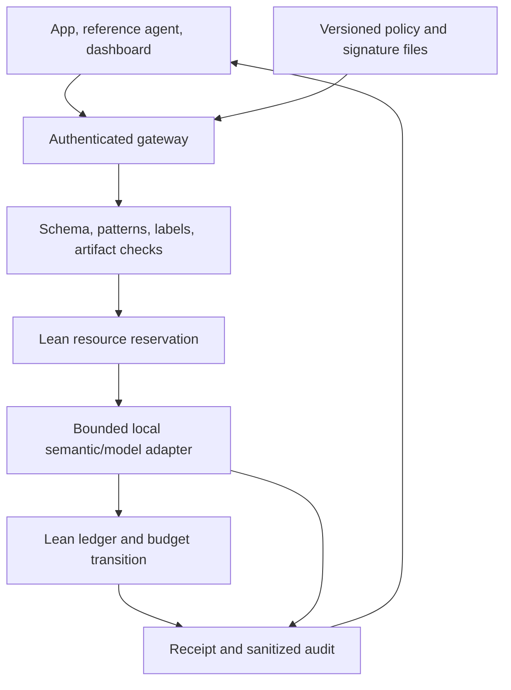

# Mathguard: challenge requirements, delivery gaps, and recovery plan

Sources checked 3 October 2026 against the original four-page challenge brief and three-page rules; implementation status refreshed 4 October after PR #6 merged. This document controls the delivery scope. The ledger is the demonstrator; **the product is an integrable hybrid AI control layer**. Proving more ledger theorems alone does not deliver the challenge.

> **Current release:** [13-GENERAL-CONTROL-LAYER.md](13-GENERAL-CONTROL-LAYER.md) describes the compiled G1 path, shared SDK API and schema-3 controls. [RELEASE-ASSURANCE.md](verification/RELEASE-ASSURANCE.md) records the 156-record catalog, 189-case runtime suite and actual local-model evidence. [GENERAL-CONTROL-INTEGRATION.md](verification/GENERAL-CONTROL-INTEGRATION.md) retains the earlier 70-case integration checkpoint. Source interpretations below remain unchanged.

## What the source audit actually found

The earlier repository already listed most official requirements, including the two scoring tables. The failure was treating those descriptions as delivery progress: at that checkpoint, `main` had a formal model and native demos, without a callable gateway, policy loader, real-model adapter, interactive dashboard or gateway integration suite. The merged implementation supplies all four deliverables, actual local-model operational evidence and a ten-slide presentation. Independent unseen detection evaluation, human browser rehearsal and external submission acceptance remain open.

Primary sources, retrieved directly and checked visually:

- [Detailed brief, D](https://mudnibfuppwadjkynscc.supabase.co/storage/v1/object/public/task-files/6f0f5e2e-246f-4078-a3f7-1aad9152e9f0/files/e251f2e9-fc1d-45b4-b92e-03be0adce8dc.pdf), SHA-256 `786a9bb4a858f98dd178085dc27ad5fb81d599a523d9318901ef2a0ff6aaf11c`.
- [Competition rules, R](https://mudnibfuppwadjkynscc.supabase.co/storage/v1/object/public/task-files/6f0f5e2e-246f-4078-a3f7-1aad9152e9f0/files/61290006-9e3e-4582-b381-2cd6f313ecf5.pdf), SHA-256 `31a3fb1537ac1d02d3f4c8e22989b2a377d82c1f7ff2df749f461de695784924`.

These match the earlier uploaded originals byte-for-byte. The Polish compendium is a useful secondary review, not a replacement for the brief. Corrections to its interpretation:

1. Paid subscriptions are **not provided** (D p4 §7); the source does not expressly prohibit using one's own paid service. The runnable demo should nevertheless work with a local model and no subscription.
2. Gateway, proxy, middleware, and SDK wrapper are alternatives (D p2 §2–3). The examples of app/agent/MCP/model communication do not mandate implementing every protocol.
3. Configurable strictness is explicit; **exactly three** levels, last-good reload, holdout methodology, artifact hashes, and Docker Compose are engineering recommendations. We adopt several, but label them as design choices.
4. The brief asks for resilient budgeting of external/local models and historical-exploit mitigation. It does not explicitly demand a distributed quota implementation or a production cluster. A single serialized owner is an honest first deployment; multiple independent quota owners would be unsafe.
5. The brief asks for ecosystem threat analysis, mentioning OWASP; it does not require certification against every OWASP entry.
6. The formal award threshold is 50% of points in phase 1 (R p2 §12). It is not a promise that a particular list of features earns those points, nor an explicit rule that one missing deliverable automatically disqualifies a project.

## Scoring and operational deadline

| Criterion | D p4 §8 | R p2 §11 | Evidence to make visible |
|---|---:|---:|---|
| Guardrail robustness | 30 | 30 | Allowed/blocked/redacted cases; semantic evaluation; hard gates resist unsafe verdicts |
| Architecture/performance | 20 | 20 | Actual mediation path, bounded work, measured full-request and stage latency |
| Security reporting | 20 | 20 | Interactive posture/resource panels; useful sanitized audit export |
| Test completeness | 15 | 20 | Reproducible executable suite; negative controls, races, failures, ad-hoc cases |
| Implementability/scalability | 15 | 10 | Clean setup; provider adapter; explicit single-owner deployment and scaling plan |

Both allocate 70 points to the first three criteria and 30 to tests plus implementability. Do not optimize for one disputed table or invent an estimated score. Obtain the applicable weighting from a mentor without blocking implementation.

R p1 §5 says 23:00 on 3 October to 23:00 on 4 October. The compendium reports an 11:00 finish on 4 October in [HackTribe's schedule](https://hackyeah2026.hacktribe.co/schedule); that authenticated schedule was not independently readable in this review. **Plan to submit by 09:30 Europe/Warsaw on 4 October, protecting the earlier reported 11:00 cutoff.** This is our conservative operational target, not a verified correction of the rules. Confirm the cutoff and pitch duration with organizers. Do not wait until the written 23:00 deadline.

## Requirement-to-evidence matrix

`Implemented/tested` below means local runtime tests, not production assurance or live classifier accuracy. Fixture verdicts are explicitly labeled. The exact current commands and limits are in [the runtime contract](07-TEAM-INTEGRATION-CONTRACT.md).

| ID / source | Required capability | Current implementation and test evidence | Remaining acceptance / owner |
|---|---|---|---|
| D1, D p2 §3.1 | Functional control layer + diagram | `gateway/` + SDK, compiled G1/W1 and ledger/budget/flow worker; README diagram; actual HTTP/local-model/ledger rehearsal | Judge clean-clone walkthrough; the SDK must mediate each integrated boundary / engine + product |
| D2, D p2–3 §3.2 | Documented configurable policies | `policies/`, strict validation, thresholds, PII block/redact, model/tool allowlists, budgets; valid/invalid live edits exercised | Judge changes the printed private runtime file; independent operator rehearsal / engine |
| D3, D p3 §3.3 | Interactive dashboard | `dashboard/`: model/tool/message inspection, approval, policy/feed, posture, resources and exports; 12 DOM/request cases plus actual HTTP serving | Browser layout/download/human-click rehearsal remains open / product |
| D4, D p3 §3.4 | Ready-to-run automated suite | `make test`: 189 actual-worker runtime cases, 14 static cases and pinned Lean/native audit checks; fixtures explicitly labeled | Human-authored independently unseen corpus and live evaluation / QA |
| C1, D p2 §2 + p3 §4.1 | Central source of controls | Validated immutable policy snapshot; higher epochs; bounded data-only feed | Broader ownership/beneficiary catalogs are future work; current three-account policy explicit |
| C2, D p3 §4.2.1 | Deterministic controls | Role auth, bounded exact schemas, ledger gates, supported PII/secrets, Polish/Unicode/encoded/split facts, structured redaction and allowlists; current-policy history recheck | Pattern coverage remains finite; independent unseen variants / engine |
| C3, D p2 §2 + p3 §4.2.2 | Semantic AI controls | Actual Ollama 0.35.1 / Qwen2.5 1.5B, shared strict-schema prompt and bounded host verdict fusion; eight development outcomes and operational traces recorded | Known indirect-input miss and independently unseen quality remain open; valid JSON is not correct detection / engine |
| C4, D p3 §4.3 | Budget/resource governance | Lean reserve/charge kernels, durable reservation before provider dispatch, full conservative charge and separate observed usage; atomic financial call slot | Global vector only; sample permits 12 complete chats before other usage. Per-session vectors/distributed quotas are follow-ups; uncertainty is not refunded |
| C5, D p3 §4.4 | Historical exploit mitigation | Reloadable literal signatures; block unsafe loaders; bounded artifact byte hash/header/repository checks; no execution | Link representative signatures to primary incident/advisory sources; expand corpus / security |
| C6, D p3 §4.5 | Security and management reports | Counters, request/control latency, resources, sanitized reasons/JSONL/management export; SQLite durable metadata with bounded paginated exports | Independent judge-hardware performance baseline; browser downloads/human review / product |
| C7, D p3 §4.6 | Positive and negative self-tests | Real state assertions, approvals/replay/conflict, redaction, policy/feed, races, resource/failure tests | No classifier-accuracy claim from fixture tests / QA |
| V1, D p4 §6 | Unprepared prompts | Live prompt panel and shared enforcement path; known-input follow-up recorded without a universal detection claim | Arbitrary unseen mentor prompts remain an evaluation task / product |
| V2, D p4 §6 | Judges modify config/feeds | Higher epoch/version, last-good retention, active version/errors; valid/invalid changes exercised through public routes | Independent judge/operator edit sequence / engine |
| V3, D p4 §6 | Performance telemetry | Real request/control p50/p95 and sample counts; actual provider-stage timings and separately observed tokens/time | Independent direct-provider/overhead benchmark on judge hardware / QA |
| T1, D p3 §5 | Stack/license flexibility | Python stdlib; pinned Lean/Mathlib; exact model/digest/installed Apache-2.0 license and Ollama MIT source recorded | Project-owner distribution license and current deployment notices / coordinator |
| T2, D p4 §7 | Self-supplied setup/local models | `make setup MODEL=<exact-id>` checks local weights and actual strict-schema readiness; real local evidence; no silent fixtures/cloud relay | Prepared judge machine with weights/toolchain cached and actual cloud-disabled daemon / operator |
| S1, R p1 §5 | Title/team/members/description | Updated form answers, technology/resources, evidence/limits and deliverable links in `01-PRODUCT-AND-CHALLENGE.md` | Exact registered team/roster/contact and actual platform field limits / coordinator |
| S2, R p1 §5 | PDF, maximum 10 slides | Rendered/checked ten-slide PDF, editable deck and Polish tutorial/English scripts in `submission/` and `docs/` | Final registered identity and actual HackTribe upload/acceptance / product |
| S3, R p2 §8 | Platform assessment then live finals | Local operator runbook and self-tests | Clean-clone walkthrough; accessible materials and short pitch / coordinator |
| S4, R p3 §13 | Submission freeze | SHA/evidence-based release discipline | Freeze reviewed commit and artifacts before confirmed cutoff / coordinator |

### Additional risks explicitly motivated by D p1

- **Irreversible actions / identity:** separate agent/owner/operator credentials; owner-bound exact approval; no raw execution endpoint. No real bank connection.
- **Persistent/shared memory:** only bounded, principal-bound, volatile session history; no shared vector store. This limits attack surface rather than claiming to secure arbitrary retrieval systems.
- **Runaway loops:** session step/repeat limits plus global budget and bounded ingress. New sessions do not reset global resources.
- **Nondeterminism:** fixture tests verify enforcement under chosen guard outcomes; live evaluation measures the model. Both are needed.

## Architecture and trust boundary

The worker is a private subprocess. Financial state lives only there. A gateway lock serializes the complete operation and configuration activation. The pure `execute` handler computes ledger admission and a financial tool-slot reservation, then publishes both next states together. If it rejects, the financial state is unchanged. Earlier model/guard calls remain charged. This runtime composition is tested; a proof of its full adapter/IO behavior is not claimed. Provider calls are conservatively charged at their full configured bound. A timeout terminates the adapter process, quarantines further provider calls, and retains the charge; the remote GPU job may require operator cleanup followed by explicit operator recovery, preserving the ledger and charges.

## Priorities for the remaining overnight work

Stop adding generalized ledger features and new performance representations until the four deliverables have executable evidence. Preserve the original 55+5 results and the imported generic/Next modules with their precise model/runtime boundaries.

| Priority | Work | Done when |
|---|---|---|
| P0 / first | Confirm roster, cutoff, field limits and platform acceptance | Submit current text/PDF against the registered team and confirmed platform record |
| P0 | Human operator/browser walkthrough | A teammate runs the README sequence, policy edits, approval/retry and downloads without code edits |
| P0 completed | Actual local setup, canonical gate, Prelint follow-up and presentation | Recorded model/license, 189 runtime/14 static cases, finite live rehearsals and checked ten-slide PDF |
| P1 | Human-authored unseen prompt set + live evaluation | Per-category attack success/false positives and closed-error rate, not a single inflated accuracy |
| P1 | Independent performance and threat coverage review | Judge-hardware baseline/overhead and broader source-backed signature coverage, with explicit limitations |
| P1 | Exact host/worker and persistence formalization | Checked Aristotle H1 first, followed by the scoped H2–H7 campaigns; no new proof claim from proposed tasks |
| P2 | Per-session vectors, external-tool effect protocols and scalable global quotas | Separate design/tests; no multiworker launch with duplicated allowances or exactly-once SDK claim |
| Completed model import | C1/P1/W1 + G1 proof campaign | 156 fresh axiom records; C1/P1 remain separate model evidence; runtime mapping in document 13 |

`P0` means critical to a credible submission; it is not an official binary eligibility classification. Keep [STATUS.md](../STATUS.md) honest. Actual finite local runs are now recorded; independently unseen quality and human acceptance are separate open tasks.
