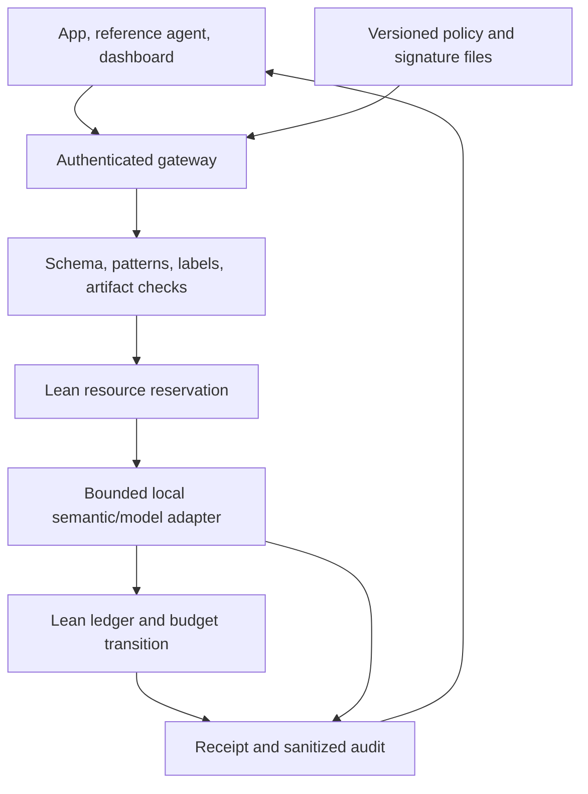

# Mathguard: challenge requirements, delivery gaps, and recovery plan

Checked 3 October 2026 against the original four-page challenge brief and three-page rules. This document controls the current delivery scope. The ledger is the demonstrator; **the product is an integrable hybrid AI control layer**. Proving more ledger theorems alone does not deliver the challenge.

> **General-kernel integration:** [13-GENERAL-CONTROL-LAYER.md](13-GENERAL-CONTROL-LAYER.md) describes the compiled G1 path, shared SDK API and schema-3 controls. Fresh 156-record/70-case evidence is in [GENERAL-CONTROL-INTEGRATION.md](verification/GENERAL-CONTROL-INTEGRATION.md). Source interpretations below remain unchanged.

## What the source audit actually found

The earlier repository already listed most official requirements, including the two scoring tables. The failure was treating those descriptions as delivery progress: `main` had a formal model and native demos, without a callable gateway, policy loader, real-model adapter, interactive dashboard, or gateway integration suite. The new implementation closes a substantial part of that gap; live-model evidence and submission packaging remain open.

Primary sources, retrieved directly and checked visually:

- [Detailed brief, D](https://mudnibfuppwadjkynscc.supabase.co/storage/v1/object/public/task-files/6f0f5e2e-246f-4078-a3f7-1aad9152e9f0/files/e251f2e9-fc1d-45b4-b92e-03be0adce8dc.pdf), SHA-256 `786a9bb4a858f98dd178085dc27ad5fb81d599a523d9318901ef2a0ff6aaf11c`.
- [Competition rules, R](https://mudnibfuppwadjkynscc.supabase.co/storage/v1/object/public/task-files/6f0f5e2e-246f-4078-a3f7-1aad9152e9f0/files/61290006-9e3e-4582-b381-2cd6f313ecf5.pdf), SHA-256 `31a3fb1537ac1d02d3f4c8e22989b2a377d82c1f7ff2df749f461de695784924`.

These match the earlier uploaded originals byte-for-byte. The Polish compendium is a useful secondary review, not a replacement for the brief. Corrections to its interpretation:

1. Paid subscriptions are **not provided** (D p4 §7); the source does not expressly prohibit using one's own paid service. The runnable demo should nevertheless work with a local model and no subscription.
2. Gateway, proxy, middleware, and SDK wrapper are alternatives (D p2 §2–3). The examples of app/agent/MCP/model communication do not mandate implementing every protocol.
3. Configurable strictness is explicit; **exactly three** levels, last-good reload, holdout methodology, artifact hashes, and Docker Compose are engineering recommendations. We adopt several, but label them as design choices.
4. The brief asks for resilient budgeting of external/local models and historical-exploit mitigation. It does not explicitly demand a distributed quota implementation or a production cluster. A single serialized owner is an honest first deployment; multiple independent quota owners would be unsafe.
5. The brief asks for ecosystem threat analysis, mentioning OWASP; it does not require certification against every OWASP entry.
6. The formal award threshold is 50% of points in phase 1 (R p2 §12). It is not a promise that a particular list of features earns those points, nor an explicit rule that one missing deliverable automatically disqualifies a project.

## Scoring and operational deadline

| Criterion | D p4 §8 | R p2 §11 | Evidence to make visible |
|---|---:|---:|---|
| Guardrail robustness | 30 | 30 | Allowed/blocked/redacted cases; semantic evaluation; hard gates resist unsafe verdicts |
| Architecture/performance | 20 | 20 | Actual mediation path, bounded work, measured full-request and stage latency |
| Security reporting | 20 | 20 | Interactive posture/resource panels; useful sanitized audit export |
| Test completeness | 15 | 20 | Reproducible executable suite; negative controls, races, failures, ad-hoc cases |
| Implementability/scalability | 15 | 10 | Clean setup; provider adapter; explicit single-owner deployment and scaling plan |

Both allocate 70 points to the first three criteria and 30 to tests plus implementability. Do not optimize for one disputed table or invent an estimated score. Obtain the applicable weighting from a mentor without blocking implementation.

R p1 §5 says 23:00 on 3 October to 23:00 on 4 October. The compendium reports an 11:00 finish on 4 October in [HackTribe's schedule](https://hackyeah2026.hacktribe.co/schedule); that authenticated schedule was not independently readable in this review. **Plan to submit by 09:30 Europe/Warsaw on 4 October, protecting the earlier reported 11:00 cutoff.** This is our conservative operational target, not a verified correction of the rules. Confirm the cutoff and pitch duration with organizers. Do not wait until the written 23:00 deadline.

## Requirement-to-evidence matrix

`Implemented/tested` below means local runtime tests, not production assurance or live classifier accuracy. Fixture verdicts are explicitly labeled. The exact current commands and limits are in [the runtime contract](07-TEAM-INTEGRATION-CONTRACT.md).

| ID / source | Required capability | Current implementation and test evidence | Remaining acceptance / owner |
|---|---|---|---|
| D1, D p2 §3.1 | Functional control layer + diagram | `gateway/` + SDK, compiled G1/W1 and ledger/budget/flow worker, `agent/run.py`; HTTP, native-state and replay tests | Run reference agent with actual local model / engine + product |
| D2, D p2–3 §3.2 | Documented configurable policies | `policies/`, strict validation, semantic threshold, PII block/redact, model allowlist, budgets | Judge edits actual file; show valid activation + invalid retention / engine |
| D3, D p3 §3.3 | Interactive dashboard | `dashboard/`: prompt, transfer, approval, policy/feed, metrics, audit, assurance | Live model run and operator rehearsal / product |
| D4, D p3 §3.4 | Ready-to-run automated suite | `scripts/test-integration.sh`, real worker plus labeled guard fixture | Add human-authored unseen corpus; run live evaluator / QA |
| C1, D p2 §2 + p3 §4.1 | Central source of controls | Validated immutable policy snapshot; higher epochs; bounded data-only feed | Broader ownership/beneficiary catalogs are future work; current three-account policy explicit |
| C2, D p3 §4.2.1 | Deterministic controls | Auth, exact schema, ledger gates, secret/email/IBAN facts, compiled input/output redact/block thresholds and tool allowlists | Pattern coverage remains finite; test additional Polish PII / engine |
| C3, D p2 §2 + p3 §4.2.2 | Semantic AI controls | Bounded local OpenAI-compatible classifier; compiled risk review/block and profile fallback; cannot override hard Lean gates | **OPEN live validation**: model ID/revision, verdict quality, false positives, timeouts / engine |
| C4, D p3 §4.3 | Budget/resource governance | Actual Lean reserve/charge kernels; before every guard/model call; atomic financial call slot | Global accounting + session steps/repeats; per-session vector quotas and actual-usage refunds are follow-ups |
| C5, D p3 §4.4 | Historical exploit mitigation | Reloadable literal signatures; block unsafe loaders; bounded artifact byte hash/header/repository checks; no execution | Link representative signatures to primary incident/advisory sources; expand corpus / security |
| C6, D p3 §4.5 | Security and management reports | Counters, request latency, resources, reasons, JSONL export, explicit assurance | Management export and detector/gate p95 implemented; live baseline/overhead measurement remains; audit is bounded and volatile / product |
| C7, D p3 §4.6 | Positive and negative self-tests | Real state assertions, approvals/replay/conflict, redaction, policy/feed, races, resource/failure tests | No classifier-accuracy claim from fixture tests / QA |
| V1, D p4 §6 | Unprepared prompts | Live prompt panel and shared enforcement path | Rehearse arbitrary mentor prompts on local model / product |
| V2, D p4 §6 | Judges modify config/feeds | Reload at next request; higher epoch/version; last-good retention | Expose active version/error and demonstrate changing/removing optional signatures / engine |
| V3, D p4 §6 | Performance telemetry | Real request p50/p95, sample count; earlier native-only benchmarks separate | Measure stage/direct-provider/control-layer overhead on GB10 / QA |
| T1, D p3 §5 | Stack/license flexibility | Python standard library; pinned Lean/Mathlib | Complete actual model/weights and dependency notices / coordinator |
| T2, D p4 §7 | Self-supplied setup/local models | Configurable loopback OpenAI-compatible endpoint; no model weights bundled | Set exact installed model name; record live smoke evidence / operator |
| S1, R p1 §5 | Title/team/members/description | Revised text in `01-PRODUCT-AND-CHALLENGE.md` | Enter actual team members and final checked status in HackTribe / Łukasz |
| S2, R p1 §5 | PDF, maximum 10 slides | Actual ten-slide PDF and editable deck in `submission/`; source-grounded implementation evidence | Final team/model acceptance, live screenshots and HackTribe upload / product |
| S3, R p2 §8 | Platform assessment then live finals | Local operator runbook and self-tests | Clean-clone walkthrough; accessible materials and short pitch / coordinator |
| S4, R p3 §13 | Submission freeze | SHA/evidence-based release discipline | Freeze reviewed commit and artifacts before confirmed cutoff / coordinator |

### Additional risks explicitly motivated by D p1

- **Irreversible actions / identity:** separate agent/owner/operator credentials; owner-bound exact approval; no raw execution endpoint. No real bank connection.
- **Persistent/shared memory:** only bounded, principal-bound, volatile session history; no shared vector store. This limits attack surface rather than claiming to secure arbitrary retrieval systems.
- **Runaway loops:** session step/repeat limits plus global budget and bounded ingress. New sessions do not reset global resources.
- **Nondeterminism:** fixture tests verify enforcement under chosen guard outcomes; live evaluation measures the model. Both are needed.

## Architecture and trust boundary

The worker is a private subprocess. Financial state lives only there. A gateway lock serializes the complete operation and configuration activation. The pure `execute` handler computes ledger admission and a financial tool-slot reservation, then publishes both next states together. If it rejects, the financial state is unchanged. Earlier model/guard calls remain charged. This runtime composition is tested; a proof of its full adapter/IO behavior is not claimed. Provider calls are conservatively charged at their full configured bound. A timeout terminates the adapter process, quarantines further provider calls, and retains the charge; the remote GPU job may require operator cleanup followed by explicit operator recovery, preserving the ledger and charges.

## Priorities for the remaining overnight work

Stop adding generalized ledger features and new performance representations until the four deliverables have executable evidence. Preserve the original 55+5 results and the imported generic/Next modules with their precise model/runtime boundaries.

| Priority | Work | Done when |
|---|---|---|
| P0 / first | Configure actual local proposer/guard and run positive/negative smoke | Two real outcomes, model identity, timings, and no fixture label confusion |
| P0 | Execute canonical local gate + inspect Prelint | All required local checks pass; meaningful findings resolved |
| P0 | Operator rehearsal: prompt, policy edit, feed edit, approval, budget exhaustion, export | A teammate can run the sequence from README without code edits |
| P0 | Produce actual <=10-slide PDF and finalize submission | Screenshots/results match frozen SHA; links open for judges |
| P1 | Human-authored unseen prompt set + live evaluation | Per-category attack success/false positives and closed-error rate, not a single inflated accuracy |
| P1 | Stage latency, management summary, failure/race coverage | Measured report includes baseline, controls overhead and classifier cost |
| P1 | Source-backed historical signatures + model license inventory | Every claim maps to a source, test, and explicit limitation |
| P2 | Per-session resource vectors, durable outbox/store, scalable global quotas | Separate design and tests; no multiworker launch with duplicated allowances |
| Completed model import | C1/P1/W1 + G1 proof campaign | 156 fresh axiom records; C1/P1 remain separate model evidence; runtime mapping in document 13 |

`P0` means critical to a credible submission; it is not an official binary eligibility classification. Keep [STATUS.md](../STATUS.md) honest. A working adapter without a live run remains “implemented, live validation pending.”
