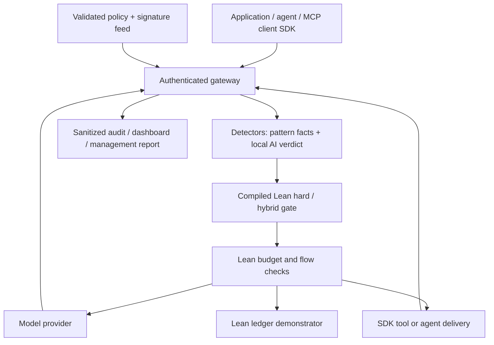

# General AI control layer: current architecture and contract

Mathguard is an SDK-integrable hybrid control gateway. The ledger demonstrates a protected
financial effect; it is one adapter behind the shared enforcement core. This revision imports
Aristotle run `ee5d328d-e8bc-4314-adc1-393b7ff9b6b7` and its preceding C1/P1/W1 proof work,
and preserves PR #4's gateway, replay behavior, budget refinements and local-check workflow.

## Architecture



The Python adapter authenticates, validates JSON, assigns injective catalog IDs, detects
patterns and prepares redacted content. It sends those facts to the private long-lived
`mathguard-worker`. The compiled `Mathguard.Control.hardDecision` is the early gate;
`storeDecision` combines hard facts with the classifier verdict/fallback. Python never
reimplements that restriction algebra. The worker also owns the ledger and global budgets.
The model classifier itself is budgeted and model-allowlisted; it does not recursively classify
its own calls. Model outputs pass through the deterministic Lean gate before return. Adding `ledger.transfer` to `irreversible_tools` also lowers the effective ledger approval threshold to 1, so every positive transfer requires approval.

## Interception API

Agent/owner credentials can POST `/v1/interactions`:

```json
{
  "schema_version": "mathguard-interaction-1",
  "session_id": "server-issued-session",
  "kind": "tool_call",
  "target": "demo.echo",
  "content": "{\"text\":\"A harmless project note\"}",
  "approval_ref": null
}
```

| Kind | Target | Release point |
|---|---|---|
| `prompt` | Empty string | Sanitized input to application |
| `agent_message` | Empty string | Sanitized message to recipient adapter |
| `tool_call` | Catalog tool name | Sanitized tool arguments, after semantic and resource gates |
| `tool_result` | Catalog tool name | Sanitized untrusted tool/MCP result |
| `model_output` | Empty string | Sanitized output from an external integration |

`ALLOWED` returns `content`, independent `deny`/`ask`/`redact` flags, kernel generation,
alerts and metadata. `BLOCKED` or `PENDING_APPROVAL` releases no content for dispatch.
Model generation uses `/v1/models/chat` so reserve-before-call and provider quarantine remain
under server control. Generic interception does not authorize unaccounted model generation.
`ledger.transfer` must use `/v1/actions`; the generic SDK cannot bypass its stronger protocol.

The gateway does not dynamically execute arbitrary remote tools. `gateway/sdk.py` calls a
trusted integration callback only after admission, parses filtered JSON before invocation,
and gates the result before returning it. The callback must validate the tool-specific argument schema before execution. Supply the callback for an MCP client's tool call
or the application's local tool implementation. Integrations must route every relevant
boundary through the SDK; a client that bypasses the layer is outside its enforcement perimeter.
No complete MCP transport/OAuth server or drop-in OpenAI proxy is claimed.

```python
import os
from gateway.sdk import ControlClient

client = ControlClient("http://127.0.0.1:8787", os.environ["MATHGUARD_AGENT_TOKEN"])
result = client.call_tool("demo.echo", {"text": "A project note"},
                          lambda name, args: {"echo": args["text"]})
message = client.allow("agent_message", "Send this harmless note to the next agent.")
```

## Policy schema 3

All profiles retain the existing budget, model, artifact and ledger fields and add:

| Field | Meaning |
|---|---|
| `profile` | `strict`, `balanced`, `permissive`; actual semantic failure behavior |
| `allowed_tools` | Exact catalog names; an empty list disables tool dispatch |
| `irreversible_tools` | Catalog tools requiring server-issued exact approval |
| `pii_redact_at` / `pii_block_at` | Detector thresholds, 1–101; 101 disables that score-based restriction |
| `semantic_review_at` / `semantic_threshold` | Review/block thresholds; effective review is clamped to block |

The example detector scores supported PII at 60, supported secrets at 80, and encoded
sensitive findings at 100. These are adapter rules, not calibrated probabilities. Encoded
sensitive data is additionally refused because redacting a decoded copy does not remove the
original encoded payload. `pii_action: block` clamps the effective block threshold to the
redact threshold. Lowering the semantic block threshold clamps review to the same bound.

| Classifier result | Strict | Balanced | Permissive |
|---|---|---|---|
| Below review threshold | Pass | Pass | Pass |
| At review threshold | Ask | Ask | Ask |
| At block threshold | Deny + ask | Deny + ask | Deny + ask |
| Timeout or malformed output | Deny + ask | Ask | Pass + alert |

Flags compose by union. Approval never clears a deterministic denial or a semantic
review/denial. Provider quarantine is a separate mandatory resource control: permissive
fallback can admit an interaction with an alert, but cannot start another call to a provider
whose timed-out job has not been stopped. Strictness does not disable budget/flow checks.

Policy and feed candidates are parsed before activation. The worker validates the G1 policy
and installs the control snapshot with the ledger/budget configuration in one state update.
A feed-only edit updates the compiled control snapshot too. Invalid edits retain the last
valid snapshot; no valid startup pair closes execution. Activation is on the next authenticated
POST, not a background watcher. G1 monotonicity concerns its exact effective policy fields;
arbitrary application settings or detector accuracy are not covered by `gate_mono`.

## Generic irreversible-tool approvals

POST the same envelope, with null `approval_ref`, to `/v1/interactions/approve` using the
owner token. The gateway checks and classifies the exact proposal before issuing a record;
issuance dispatches no tool. Then submit the unchanged envelope to `/v1/interactions` with
the returned reference. It is bound to principal, session, original content, kind, target,
policy epoch and feed version, expires after 300 seconds, and is consumed once. Expiry is
rechecked after semantic work. A generic admission is not an idempotent commit receipt:
external callback completion/crash recovery is the integrator's responsibility.

## Evidence mapping

| Module / property | Compiled request-path use | Scope |
|---|---|---|
| G1 hard/hybrid gate, fallback, allowlists, signature denial, PII flags | Yes: shared interactions, chat/model dispatch, ledger tool admission, artifact admission | Proved pure rules; facts/JSON/IO integration tested |
| G1 validated policy store | Yes: `ControlPolicy.valid` and `PolicyStore.reload` | Parser and atomic host configuration protocol tested |
| W1 typed wire projection | Yes: worker's ledger request decoder calls `Next.fromWire` | Begins after JSON and number validation |
| Existing ledger/budget/flow + optimized budget | Yes | Existing proofs preserved; volatile composition tested |
| C1 composite state / P1 historical-policy state | Imported and built; separate model evidence | No durable database or event-store claim |
| G1 bounded steps / one-event audit / owner-filtered recall | Model theorems and native demo | Runtime counts attempted requests conservatively; audit is a bounded metadata window; session history is isolated by host checks |

The 156 axiom records are **55 baseline + 5 refinements + 43 Next + 53 Control**. Next contains
35 original targets plus eight supporting records. The count is a catalog size, not 156
distinct end-to-end security requirements. Control records require no axioms beyond
`propext` and `Quot.sound`. Fresh proof/runtime results are recorded in
[GENERAL-CONTROL-INTEGRATION.md](verification/GENERAL-CONTROL-INTEGRATION.md).

## Requirement coverage and remaining evidence

| Official requirement | Current delivery |
|---|---|
| Integrable lightweight layer | Authenticated gateway and small SDK; architecture above |
| Centralized configurable controls | Schema 3 profiles, models/tools, thresholds, budgets, live policy/feed reload |
| Hybrid defense | Pattern facts + local classifier + compiled union of restrictions |
| Budget/resource governance | Global Lean reserve/charge; session step/repeat caps; provider deadline/quarantine |
| Historical exploits | Normalized/decoded signature facts, tool allowlists, bounded artifact hashes/format checks |
| Reporting | Dashboard prompt/tool trials, redaction/review counts, p50/p95, budget, reload alarms, JSONL and management export |
| Positive/negative self-testing | `make test`; native proofs/demos, actual-worker integration, provider and SDK HTTP cases |

Follow-up evaluation/runbook and the prepared ten-slide PDF are in
[14-OPERATOR-REHEARSAL.md](14-OPERATOR-REHEARSAL.md). Remaining submission evidence: a real installed
local model and its license/version, live accuracy and latency results, an independently supplied
unseen corpus, final deck/team acceptance, HackTribe entry and a live operator rehearsal. Detector completeness, crash recovery,
durable audit, distributed budgets, arbitrary model loading and full MCP authentication are
not delivered. The official brief allows an SDK/middleware approach; those production
extensions are not stated as mandatory protocols.

Sources: original brief/rules and page/hash references in
[10-REQUIREMENTS-RECOVERY.md](10-REQUIREMENTS-RECOVERY.md); secondary compendium and imported
[Aristotle proposal](12-ARISTOTLE-REQUIREMENTS-ADAPTATION.md). The OWASP risk taxonomy was
rechecked against the [official 2025 list](https://genai.owasp.org/llm-top-10/), and MCP integration
limits against [official security guidance](https://modelcontextprotocol.io/docs/2026-07-28/tutorials/security/security_best_practices).
The proposal's OWASP table is a design mapping, not a completeness certification or a measured
holdout result. Both disputed scoring tables and the conservative 09:30 Warsaw submission
target remain visible in document 10; the reported 11:00 cutoff still needs organizer confirmation.
